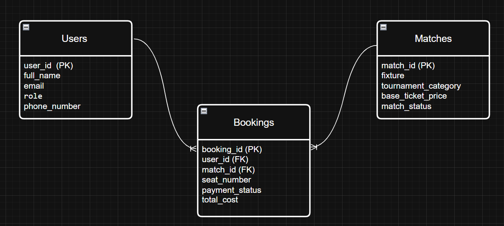

# B7A3
# ⚽ Football Ticket Booking System

A PostgreSQL database project for managing football ticket bookings. This project demonstrates database design, table relationships, constraints, and SQL queries by building a simple Football Ticket Booking System.

---

## 📌 Project Overview

This project contains a relational database with three tables:

- **Users** – Stores registered user information.
- **Matches** – Stores football match details.
- **Bookings** – Stores ticket booking information and connects Users with Matches.

The project demonstrates the use of relational database concepts such as Primary Keys, Foreign Keys, Constraints, Joins, Aggregate Functions, Subqueries, and SQL Filtering.

---

# 🗂️ Database Schema

## Users

| Column | Description |
|---------|-------------|
| user_id | Primary Key |
| full_name | User's full name |
| email | Unique email address |
| role | User role |
| phone_number | Contact number |

---

## Matches

| Column | Description |
|---------|-------------|
| match_id | Primary Key |
| fixture | Match name |
| tournament_category | Tournament |
| base_ticket_price | Ticket price |
| match_status | Match availability |

---

## Bookings

| Column | Description |
|---------|-------------|
| booking_id | Primary Key |
| user_id | Foreign Key → Users |
| match_id | Foreign Key → Matches |
| seat_number | Seat number |
| payment_status | Booking payment status |
| total_cost | Total booking cost |

---

# 🔗 Relationships

- One **User** can create multiple **Bookings**.
- One **Match** can have multiple **Bookings**.
- The **Bookings** table acts as the junction table between **Users** and **Matches**, representing a many-to-many relationship.

---

# 📊 Entity Relationship Diagram (ERD)

## ERD Preview



## Editable ERD

The editable ERD diagram is included in the repository.

```
ERD.drawio
```

---

## 🎥 Viva Video

Google Drive Link: [☁ video](https://drive.google.com/file/d/1ckpynxxxYY9XCJP-noN-fa0luVCr_3ht/view?usp=sharing)


---

# 🛡️ Constraints Used

## Primary Keys

- `user_id`
- `match_id`
- `booking_id`

## Foreign Keys

- `Bookings.user_id → Users.user_id`
- `Bookings.match_id → Matches.match_id`

## Unique Constraint

- `email`

## Check Constraints

### Users

- Valid user roles only

### Matches

- Ticket price cannot be negative
- Valid match status only

### Bookings

- Total cost cannot be negative
- Valid payment status only

---

# 🚀 SQL Concepts Used

- CREATE TABLE
- PRIMARY KEY
- FOREIGN KEY
- UNIQUE
- CHECK
- INSERT INTO
- SELECT
- WHERE
- ORDER BY
- LIMIT
- OFFSET
- LEFT JOIN
- Aggregate Functions
- Subquery
- COALESCE

---

# 📝 Queries Implemented

 Query 1

- Retrieve all available Champions League matches.

---

### Query 2

- Display booking statistics for each match.

---

### Query 3

- Replace missing payment status with **"Action Required"** using `COALESCE()`.

---

### Query 4

- Retrieve booking information with user names and match fixtures using `INNER JOIN`.

---

### Query 5

- Retrieve all users and their booking IDs, including users who have never booked a ticket using `LEFT JOIN`.

---

### Query 6

- Retrieve bookings where the total booking cost is higher than the average booking cost using a subquery.

---

### Query 7

- Retrieve the 2 most expensive matches after skipping the highest-priced match using `ORDER BY`, `LIMIT`, and `OFFSET`.

---

# 📂 Project Structure
```
└── 📁assignment-3
    ├── ERD-SS.png
    ├── ERD.drawio
    ├── QUERY.sql
    └── readme.md
```

---

# 💻 Technologies Used

- PostgreSQL
- SQL
- Beekeeper Studio
- Draw.io (ERD)

---

# 👨‍💻 Author

**Rakibul Islam**

Student | Learning PostgreSQL & Backend Development

[GitHub](https://github.com/DyM0nFl3x)
